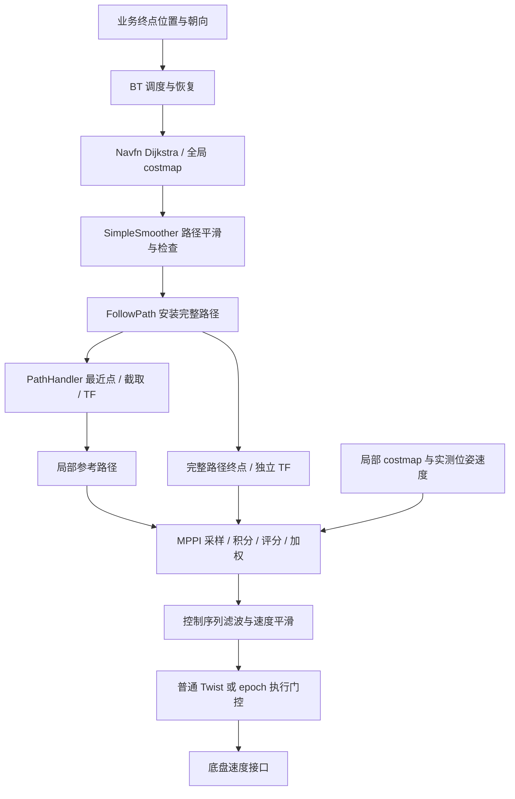

# 当前规划与控制链路代码审计（2026-09-18）

本报告审计 canonical checkout 中的当前实现，基线为 `c34631c`。它说明代码如何工作，不代表 0829 实机加载的参数，也不是实机或闭环验收。0829 冻结上下文的逐项成本实验另见 [倒退成本实验](/home/charles/project/colcon_ws/src/zsibot/zsibot_roamerx_lite/src/navigation/src/robot_navigo/doc/mppi_reverse_cost_audit_20260918.md)。

当前结构是“全局二维路径规划 + 路径平滑 + MPPI 局部轨迹与速度优化”。**局部参考路径是全局路径的一段；MPPI 生成的局部运动轨迹才是优化结果。** 没有另一个局部 A* 先生成局部路径再交给 MPPI。



## 1. 目标、BT 与全局规划

`NavigateToPose` 接收 action 或 `goal_pose`，普通默认 BT 每秒重规划一次，执行 `ComputePathToPose → SmoothPath → FollowPath`。路径平滑允许 0.2 秒并开启碰撞检查。BT PipelineSequence 允许跟踪过程中更新路径；普通恢复包括清图、旋转、等待和 BackUp。

- [目标入口及默认树选择](/home/charles/project/colcon_ws/src/zsibot/zsibot_roamerx_lite/src/navigation/src/navigo_bt_navigator/src/navigators/navigate_to_pose.cpp:72)
- [普通 BT](/home/charles/project/colcon_ws/src/zsibot/zsibot_roamerx_lite/src/navigation/src/navigo_bt_navigator/behavior_trees/navigate_to_pose_w_replanning_and_recovery.xml)

全局插件是 `navigo_navfn_planner/NavfnPlanner`，当前 `use_astar=false`，调用 Dijkstra 势场传播并提取路径。输入是 map 坐标系下的起终点和全局 costmap。普通请求未指定起点时，planner 从 costmap/TF 获得机器人位置。目标不可达时，当前配置允许在目标附近 0.5 m 区域选择最近可达位置，因此“控制器安装路径的终点”不一定严格等于最初业务目标。

- [插件、算法和容差配置](/home/charles/project/colcon_ws/src/zsibot/zsibot_roamerx_lite/src/navigation/src/robot_navigo/params/navigo_params.yaml:215)
- [起点与坐标转换](/home/charles/project/colcon_ws/src/zsibot/zsibot_roamerx_lite/src/navigation/src/navigo_path_planner/src/planner_server.cpp:305)
- [Dijkstra 与目标容差搜索](/home/charles/project/colcon_ws/src/zsibot/zsibot_roamerx_lite/src/navigation/src/navigo_navfn_planner/src/navfn_planner.cpp:234)

全局 costmap 当前为 map frame、0.05 m 分辨率，使用 static、obstacle、inflation 层；局部 costmap 为 odom frame、8×8 m、0.05 m，使用 obstacle、inflation 层。[配置](/home/charles/project/colcon_ws/src/zsibot/zsibot_roamerx_lite/src/navigation/src/robot_navigo/params/navigo_params.yaml:112)

Navfn 是二维位置搜索，不包含完整朝向扫掠、四足步态或底盘响应。全局栅格路径可达不保证局部空间足以转身。配置的 `nav2_smoother::SimpleSmoother` 是外部依赖插件，当前配置为最大 200 次迭代、开启 refinement；本次只审计调用和配置，没有审计该安装依赖的内部算法。[平滑器配置](/home/charles/project/colcon_ws/src/zsibot/zsibot_roamerx_lite/src/navigation/src/robot_navigo/params/navigo_params.yaml:351)

## 2. 完整路径如何变成局部参考

控制器安装完整路径后同时保存终点、当前路径及更新计数。[安装入口](/home/charles/project/colcon_ws/src/zsibot/zsibot_roamerx_lite/src/navigation/src/navigo_path_controller/src/controller_server.cpp:899)

`PathHandler` 每轮执行：

1. 把机器人位姿转换到完整路径 frame。
2. 在路径前段限定搜索最近点。默认搜索距离是局部 costmap 最大边的一半，当前为 4 m，避免在自交路径上任意跳段。
3. 从最近点按路径累计长度截取，当前 `prune_distance=2.0 m`。
4. 转到局部 costmap 的 odom frame，遇到边界即停止收集。
5. 删除最近点之前的旧路径点；空结果视为失败。

[截取、转换与剪枝](/home/charles/project/colcon_ws/src/zsibot/zsibot_roamerx_lite/src/navigation/src/navigo_mppi_controller/src/path_handler.cpp:48)

**完整目标独立传入优化器。** `getTransformedGoal` 取保存的完整路径最后一个点，使用当前机器人时间戳做 TF；不能拿截取的 2 m 参考末端替代完整终点。控制器先取完整目标，再取局部参考，分别传给优化器。[调用](/home/charles/project/colcon_ws/src/zsibot/zsibot_roamerx_lite/src/navigation/src/navigo_mppi_controller/src/controller.cpp:145) · [完整目标来源](/home/charles/project/colcon_ws/src/zsibot/zsibot_roamerx_lite/src/navigation/src/navigo_mppi_controller/src/path_handler.cpp:189)

`transformed_global_plan` 发布的就是已经过上述处理的参考路径。离线实验可直接给 Optimizer 的 path 参数，不应再次经 PathHandler 裁剪。[可视化发布](/home/charles/project/colcon_ws/src/zsibot/zsibot_roamerx_lite/src/navigation/src/navigo_mppi_controller/src/controller.cpp:205)

## 3. MPPI 优化变量与时序

当前配置为控制频率 10 Hz、预测步长 0.1 s、30 步、500 个样本、每轮 1 次迭代，即 3 s 时域。运动模型为 Omni，优化变量是每个时刻的机体系 `vx、vy、wz`。基线速度上限为前后各 0.15 m/s、横向 0.15 m/s、旋转 0.1 rad/s。[配置](/home/charles/project/colcon_ws/src/zsibot/zsibot_roamerx_lite/src/navigation/src/robot_navigo/params/navigo_params.yaml:256)

流程如下：

1. 读取当前位姿、实测速度、局部参考、完整目标；清零本轮 costs 和共享路径缓存。
2. 在上一轮移位后的 nominal 控制序列上加高斯噪声，标准差分别为 0.1、0.1、0.08。
3. 用运动模型预测并积分全部轨迹。
4. 依配置顺序累计 critic 成本，再加入控制正则。
5. 对所有候选作 softmax 权重平均，得到新的控制序列；并非只取最低成本样本。
6. 施加控制约束、Savitzky–Golay 滤波，读取本轮命令并移位用于下一周期。

[主循环](/home/charles/project/colcon_ws/src/zsibot/zsibot_roamerx_lite/src/navigation/src/navigo_mppi_controller/src/optimizer.cpp:157) · [采样与积分](/home/charles/project/colcon_ws/src/zsibot/zsibot_roamerx_lite/src/navigation/src/navigo_mppi_controller/src/optimizer.cpp:267) · [权重平均](/home/charles/project/colcon_ws/src/zsibot/zsibot_roamerx_lite/src/navigation/src/navigo_mppi_controller/src/optimizer.cpp:431)

对样本 k，其总分为：

```text
J_k = Σ critic_cost_k + Σ_axis [gamma / sigma_axis² × Σ_t u_nominal(t) × delta_u_k(t)]
w_k = exp(-(J_k - min(J)) / temperature) / Σ_j exp(-(J_j - min(J)) / temperature)
u_new(t) = Σ_k w_k × u_sample_k(t)
```

当前 temperature=0.3、gamma=0.015。控制正则包含 nominal 与扰动的乘积，可以为负，不能称作加速度罚项。critic 中通常先乘权重再取 power，不能把权重数值直接当成可跨项比较的贡献大小。

### Warm start、噪声与滤波

- 保留上一轮优化结果，移位后作为下一轮 nominal；失败 reset 会清空控制历史。
- 默认 `regenerate_noises=false`，初始化/reset 时生成噪声矩阵，正常周期复用；并非每轮重新独立随机采样。[噪声实现](/home/charles/project/colcon_ws/src/zsibot/zsibot_roamerx_lite/src/navigation/src/navigo_mppi_controller/src/noise_generator.cpp:26)
- SG 滤波保留 4 项控制历史；这与 nominal 未来序列是两种状态。[滤波历史](/home/charles/project/colcon_ws/src/zsibot/zsibot_roamerx_lite/src/navigation/src/navigo_mppi_controller/include/navigo_mppi_controller/tools/utils.hpp:590)
- 当前控制周期等于模型步长，开启 sequence shift；发布索引 1 的控制，不是永远发布数组第 0 项。[输出选择](/home/charles/project/colcon_ws/src/zsibot/zsibot_roamerx_lite/src/navigation/src/navigo_mppi_controller/src/optimizer.cpp:465)

### 运动模型边界

第 0 步速度来自实测，后续预测速度直接取前一时刻采样控制，再积分平面位姿。当前模型没有真实加速度响应、SDK延迟、机械狗惯性或步态动力学。[模型实现](/home/charles/project/colcon_ws/src/zsibot/zsibot_roamerx_lite/src/navigation/src/navigo_mppi_controller/include/navigo_mppi_controller/motion_models.hpp:53)

基线 legacy 模式的高斯采样并未先按所有速度边界硬裁剪，样本可能超限；ConstraintCritic提供部分软惩罚，最终加权控制序列才clip。因此“3秒×0.1rad/s只能转约17°”描述的是约束内执行能力，不能声称每个采样轨迹都只转17°。背对目标时，短时域难以看到转身后推进收益，是机制解释，不是0829主因的直接证据。

## 4. 当前启用的目标项

距离开关以下均指距完整目标的当前位置距离。权重来自当前基础配置；历史实验必须使用自己的参数来源。

| Critic | 权重 / power | 实际计算与开关 | 源码 |
|---|---:|---|---|
| Constraint | 4 / 1 | 积分带符号平移合速度越界量；Omni用vx符号给合速度正负；不是加速度约束 | [实现](/home/charles/project/colcon_ws/src/zsibot/zsibot_roamerx_lite/src/navigation/src/navigo_mppi_controller/src/critics/constraint_critic.cpp:31) |
| Cost | 3.81 / 2 | 中心cost累积，必要时footprint碰撞检查；near collision加critical，碰撞设1e6；最终 `(3.81/254 × 累积量/步数)^2`。1m内取消普通膨胀偏好，不取消碰撞检查 | [实现](/home/charles/project/colcon_ws/src/zsibot/zsibot_roamerx_lite/src/navigation/src/navigo_mppi_controller/src/critics/cost_critic.cpp:121) |
| Goal | 5 / 1 | 1.4m内启用；轨迹所有预测位置到完整目标距离的平均值 | [实现](/home/charles/project/colcon_ws/src/zsibot/zsibot_roamerx_lite/src/navigation/src/navigo_mppi_controller/src/critics/goal_critic.cpp:36) |
| GoalAngle | 3 / 1 | 0.5m内启用；轨迹yaw与局部参考最后一点yaw的平均绝对角差。开关与角度目标来源不同 | [实现](/home/charles/project/colcon_ws/src/zsibot/zsibot_roamerx_lite/src/navigation/src/navigo_mppi_controller/src/critics/goal_angle_critic.cpp:36) |
| PathAlign | 14 / 1 | 按累计行程对应路径位置，平均横向/位置偏差；当前不使用path yaw。距目标≤0.5m、最远索引不足20、路径堵塞比例过大时跳过 | [实现](/home/charles/project/colcon_ws/src/zsibot/zsibot_roamerx_lite/src/navigation/src/navigo_mppi_controller/src/critics/path_align_critic.cpp:46) |
| PathFollow | 5 / 1 | 预测终点到“批次最远触达索引+5”参考位置的距离；目标1.4m内关闭 | [实现](/home/charles/project/colcon_ws/src/zsibot/zsibot_roamerx_lite/src/navigation/src/navigo_mppi_controller/src/critics/path_follow_critic.cpp:35) |
| PathAngle | 2 / 1 | 朝向与前向参考点方向夹角；目标0.5m内或当前方向误差<1rad时关闭；forward_preference=true | [实现](/home/charles/project/colcon_ws/src/zsibot/zsibot_roamerx_lite/src/navigation/src/navigo_mppi_controller/src/critics/path_angle_critic.cpp:58) |
| PreferForward | 5 / 1 | `5 × Σ max(-vx,0)×dt`；目标0.5m内关闭；不累计过去已倒退距离 | [实现](/home/charles/project/colcon_ws/src/zsibot/zsibot_roamerx_lite/src/navigation/src/navigo_mppi_controller/src/critics/prefer_forward_critic.cpp:33) |
| VelocityDeadband | 20 / 1 | 积分各轴不可执行小速度惩罚；当前零速度合法 | [实现](/home/charles/project/colcon_ws/src/zsibot/zsibot_roamerx_lite/src/navigation/src/navigo_mppi_controller/src/critics/velocity_deadband_critic.cpp:41) |

“批次最远触达点”不是机器人已经走到的最远历史位置。实现为每个样本末端寻找最近路径索引，再在整批中取最大值。[实现](/home/charles/project/colcon_ws/src/zsibot/zsibot_roamerx_lite/src/navigation/src/navigo_mppi_controller/include/navigo_mppi_controller/tools/utils.hpp:292) 所以改变候选集也可能改变PathFollow、PathAngle参考点；固定候选成本只宜在同一批次比较。

Critic按配置顺序运行，前项设置fail后后项跳过。[manager](/home/charles/project/colcon_ws/src/zsibot/zsibot_roamerx_lite/src/navigation/src/navigo_mppi_controller/src/critic_manager.cpp:67) 例如全部候选碰撞时，后续缺失项不能解释为“该项正常计算后等于零”。

## 5. 参数写在 YAML 不等于实现读取

| 配置 | 当前实际行为 |
|---|---|
| `ax_max / ay_max / ax_min / az_max` | MPPI参数读取与运动模型中未使用，不形成预测加速度约束 |
| `PathAngleCritic.mode` | 本实现未读取；实际读取 `forward_preference` |
| `CostCritic.trajectory_point_step` | 本实现未读取；评分循环逐步检查全部30个预测点 |
| `AckermannConstraints.min_turning_r` | 仅Ackermann模式生效，当前Omni不使用 |
| `regenerate_noises` | 实际读取，缺省false |
| `prune_distance` | 实际读取，当前2m，是局部参考截取长度，不是3秒预测行程 |

[Optimizer 参数读取](/home/charles/project/colcon_ws/src/zsibot/zsibot_roamerx_lite/src/navigation/src/navigo_mppi_controller/src/optimizer.cpp:63) · [PathAngle 参数读取](/home/charles/project/colcon_ws/src/zsibot/zsibot_roamerx_lite/src/navigation/src/navigo_mppi_controller/src/critics/path_angle_critic.cpp:23) · [Cost 参数读取](/home/charles/project/colcon_ws/src/zsibot/zsibot_roamerx_lite/src/navigation/src/navigo_mppi_controller/src/critics/cost_critic.cpp:23)

## 6. 新前向对齐与 MPPI 的关系

基础配置 `forward_alignment.enabled=false`、`vx_min=-0.15`。实验overlay启用ALIGN/TRACK/FINAL状态，vx_min=0、vy_max=0。[overlay](/home/charles/project/colcon_ws/src/zsibot/zsibot_roamerx_lite/src/navigation/src/robot_navigo/params/forward_alignment_experiment.yaml)

ALIGN/FINAL生成旋转或停车命令并提前返回，本周期不调用MPPI；TRACK才运行优化器。模式切换重置旧控制序列并确认停稳。前向模式额外在采样前约束速度及死区，滤波后重新约束并检查最终轨迹的footprint扫掠。因此不是在MPPI预测倒退后仅把输出截零。[状态调用](/home/charles/project/colcon_ws/src/zsibot/zsibot_roamerx_lite/src/navigation/src/navigo_mppi_controller/src/controller.cpp:145) · [模式切换](/home/charles/project/colcon_ws/src/zsibot/zsibot_roamerx_lite/src/navigation/src/navigo_mppi_controller/src/controller.cpp:266) · [最终扫掠](/home/charles/project/colcon_ws/src/zsibot/zsibot_roamerx_lite/src/navigation/src/navigo_mppi_controller/src/optimizer.cpp:170)

这仍不是完整“终点允许有限微退”模式；普通跟踪禁止负vx与显式BackUp权限应分别解释。全局路径要求在过窄区域转身时，局部对齐会拒绝，仍可能需要提前调整路径或重规划。

## 7. 普通链路与 epoch 链路

普通路径使用普通FollowPath与Twist。当前常规launch把controller/behaviors输出重映射到 `cmd_vel_nav`，速度平滑器输出 `cmd_vel`。平滑器默认20Hz、OPEN_LOOP，执行速度、加减速与死区约束。普通控制器送给MPPI的是阈值处理后的odom速度。[launch](/home/charles/project/colcon_ws/src/zsibot/zsibot_roamerx_lite/src/navigation/src/robot_navigo/launch/navigation_launch.py:220) · [控制器速度输入](/home/charles/project/colcon_ws/src/zsibot/zsibot_roamerx_lite/src/navigation/src/navigo_path_controller/src/controller_server.cpp:940) · [平滑配置](/home/charles/project/colcon_ws/src/zsibot/zsibot_roamerx_lite/src/navigation/src/robot_navigo/params/navigo_params.yaml:373)

epoch链路在算法外增加身份与执行授权：

- 捕获定位身份和起点，给规划及平滑结果保留身份；只接受当前最新结果。
- 路径安装和授权匹配后输出带token、序号、来源时间及运动阶段的命令。
- `/cmd_vel_epoch_raw → epoch平滑器 → /cmd_vel_epoch → safety gate → /cmd_vel_safe`。
- 定位、路径授权或命令新鲜度不满足时拒绝执行。它是控制结果有效性的约束，不是新增轨迹优化算法。

[epoch规划/平滑](/home/charles/project/colcon_ws/src/zsibot/zsibot_roamerx_lite/src/navigation/src/navigo_behavior_tree/plugins/action/epoch_navigation.cpp:465) · [控制器输出协议](/home/charles/project/colcon_ws/src/zsibot/zsibot_roamerx_lite/src/navigation/src/navigo_path_controller/src/controller_server.cpp:1055) · [epoch平滑入口](/home/charles/project/colcon_ws/src/zsibot/zsibot_roamerx_lite/src/navigation/src/navigo_velocity_optimizer/src/velocity_smoother.cpp:204) · [安全门控](/home/charles/project/colcon_ws/src/zsibot/zsibot_roamerx_lite/src/navigation/src/robot_navigo/scripts/nav_safety_gate.py:295)

启用epoch时，普通恢复树只清图和等待；显式允许BackUp的树才提供有界后退。[无运动恢复树](/home/charles/project/colcon_ws/src/zsibot/zsibot_roamerx_lite/src/navigation/src/navigo_bt_navigator/behavior_trees/navigate_to_pose_with_epoch.xml) · [BackUp恢复树](/home/charles/project/colcon_ws/src/zsibot/zsibot_roamerx_lite/src/navigation/src/navigo_bt_navigator/behavior_trees/navigate_to_pose_with_epoch_backup.xml)

必须核对实际launch、参数overlay和底盘订阅topic，不能因代码存在就假定某次部署已经启用epoch、forward alignment或安全门控。本次审计止于导航侧速度接口，未证明历史底盘SDK的逐条执行语义。

## 8. 0829 实验解释边界

本代码审计能说明倒退软代价如何参与权衡，但不能单独证明0829哪个critic导致持续倒退。历史cost实验至少应区分完整目标与局部参考末端，记录每项开关、批次参考索引、正则、softmax、输出滤波及deadband。

实录debug的完整路径终点来自已安装path，比原始planner `/plan` 更接近优化器目标；但普通debug用路径终点原时间戳做TF，当前优化器用机器人当前时间戳，二者仍可能不同。录制costmap还有发布延迟和OccupancyGrid量化；缺失nominal序列、SG历史和随机状态时，只能进行假设明确的冻结上下文重评估，不能声称恢复历史exact cost。

[debug完整终点转换](/home/charles/project/colcon_ws/src/zsibot/zsibot_roamerx_lite/src/navigation/src/navigo_path_controller/src/controller_server.cpp:1240)
