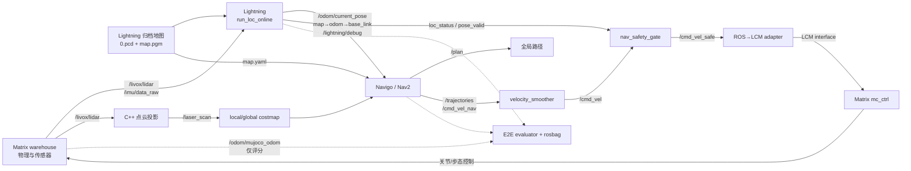

# Matrix + Lightning 点到点导航闭环

## 目标与边界

该链路用于在 `scene_terrain_wh` 中验证真实的软件闭环：Matrix 产生 LiDAR、IMU 和机器人动力学，Lightning 产生定位与导航 TF，Navigo 规划和控制，ROS-to-LCM 适配器驱动 Matrix 的 `mc_ctrl`。

`/odom/mujoco_odom` 只允许被录包和验收程序读取，用于评价 Lightning 轨迹和确认机器人确实运动。禁止使用 `pub_tf`、`sim_tf_bridge.py`、`odom_to_tf_broadcaster` 或 `run_sim_with_nav.sh` 将真值注入导航。

## 实际数据流



障碍物链路为 `/livox/lidar` -> C++ `livox_scan_projector` -> `/laser_scan` -> local/global costmap。Matrix 直接订阅 `PointCloud2`，不经过 Python 逐点转换。

## 基线地图

- 场景：`scene_terrain_wh`
- 地图目录：`/home/charles/project/locnav_ws/data/matrix/scene_terrain_wh/20260315_lightning`
- 建图输入：`/mnt/data/datasets/quadrobot_nav/rosbag2_2026_03_15-17_13_12`
- 输入时长：约 376.6 秒，LiDAR 3765 帧，IMU 75211 帧
- 地图：101 个关键帧，`global.pcd` 806961 点
- 栅格：1408 x 1920，分辨率 0.05 m，原点 `(-29.05, -45.0)`

地图目录内保留原始配置、建图日志、点云块、栅格地图和 `SHA256SUMS`。runner 启动前会校验归档；`TiledMap` 始终从当前 `system.map_path/<id>.pcd` 加载地图块，不依赖 `index.txt` 中保存时留下的旧路径。

## 一键运行

```bash
source /opt/ros/humble/setup.bash
source /home/charles/project/matrix_closed_loop_ws/install/setup.bash

ros2 run robot_navigo matrix_closed_loop_run.sh \
  --matrix-root /home/charles/project/locnav_ws/src/zsibot/matrix \
  --workspace /home/charles/project/matrix_closed_loop_ws \
  --map /home/charles/project/locnav_ws/data/matrix/scene_terrain_wh/20260315_lightning/map.yaml \
  --relative-x 1.0 --relative-y 0.0 --relative-yaw 0.0 \
  --timeout 180
```

默认在本机 X11 桌面启动可见的 Matrix UE 窗口，并使用 `xdotool` 验证窗口已映射；只有无人值守回归才加 `--headless`。脚本会临时把 Matrix `use_gamepad` 改为 `0`，只在 `mc_ctrl` 启动期间生效，随后立即恢复原文件。退出时会关闭本轮进程；`--keep-running` 除外。

## 验收机制

运行前检查：

1. LiDAR、IMU、真值里程计均有实时消息。
2. `/odom/current_pose` 只有 Lightning 发布。
3. `/laser_scan` 只有 Matrix C++ projector 发布。
4. 没有真值 TF 发布者和重复 ROS 节点名。
5. Nav2 lifecycle 节点均为 active，`NavigateToPose` action 可用。
6. `mc_ctrl` 存活且订阅端由 `/cmd_vel_safe` 驱动。

运行后检查：

1. Action 必须返回 `SUCCEEDED`，且最终位置/航向误差达标。
2. MuJoCo 真值必须显示与目标量级一致的实际运动，防止“未动但 Action 成功”。
3. `/cmd_vel_nav`、`/cmd_vel`、`/cmd_vel_safe` 都必须收到非零指令。
4. 控制器输出至少 8 Hz、最大间隔不超过 0.25 秒；LaserScan 和 odom 至少 5/8 Hz。odom 同时记录源消息时间与订阅接收时间，源时间用于判断算法产出是否断帧，接收时间用于诊断 DDS/recorder 调度抖动。
5. Lightning 相对真值轨迹的位置 RMSE、最大误差和航向误差必须达标。
6. `/lightning/loc_status` 在测试窗口中必须一直为 NORMAL。
7. 定位状态心跳不能断流，`/nav_safety_gate/gate_status` 必须持续为 NORMAL。
8. rosbag 必须包含原始 LiDAR/IMU、定位与 debug、目标 pose、TF、地图、全局/局部路径、两级 costmap、控制器轨迹和完整速度链；缺少任一必需 topic 时本轮直接失败。

## 已验证结果

2026-08-27 的 1 m 前进测试结果目录：

`/home/charles/project/matrix_closed_loop_ws/log/matrix_closed_loop_visible_warehouse_20260827`

| 指标 | 结果 |
| --- | ---: |
| NavigateToPose | SUCCEEDED |
| MuJoCo 实际位移 | 0.840 m |
| 最终目标位置误差 | 0.236 m |
| 最终目标航向误差 | 0.049 rad |
| Lightning 相对真值位置 RMSE / 最大误差 | 0.063 / 0.089 m |
| Lightning 相对真值航向 RMSE / 最大误差 | 0.007 / 0.014 rad |
| `/cmd_vel_nav` | 10.17 Hz，最大间隔 0.104 s |
| `/cmd_vel` | 20.00 Hz，最大间隔 0.055 s |
| `/cmd_vel_safe` | 20.12 Hz，最大间隔 0.055 s |
| `/laser_scan` | 10.05 Hz，源最大间隔 0.181 s |
| `/odom/current_pose` | 源频率 9.88 Hz，源最大间隔 0.207 s；接收最大间隔 0.213 s |

本轮所有自动验收项通过，定位状态从 `INITIALIZING` 进入 `ACTIVE` 后没有降级或丢失。runner 在 `DISPLAY=:1` 验证并激活了 `zsibot_mujoco_ue` 可见窗口。初始化使用连续三帧候选确认，避免单帧 NDT 局部极值直接建立全局锚点。

## 已知限制

1. 全局 NDT 在重复结构中仍可能落入错误极值。连续三帧初始化确认和运行期一致性门可拒绝明显跳变；Matrix 专用配置允许健康 LIO 保持 NORMAL 20 秒，30 秒仍无可信全局匹配则进入 LOST。最终回归窗口内得到了多次可信全局匹配且状态持续正常，但 13 秒测试仍不能证明长时间全局定位稳定。
2. 成功回归中仍有 12 次 TF message-filter 丢帧，未影响本轮短距离闭环，但长距离和障碍绕行还需验证。
3. 使用当前代码和历史提交重新离线建图时均出现过 LIO 发散，2026-03-15 地图尚未做到从原始 bag 完全可复现。
4. 当前只证明了 1 m 无障碍直线点到点，不代表转向、横移、动态障碍和长距离导航已经通过。
5. Matrix 配置使用已校正 LIO 作为相对运动源，定位输出约为 LiDAR 的 10 Hz，而不是通用配置宣称的 IMU 级 50-100 Hz。当前控制器回归门槛为 8 Hz；恢复安全、连续的高频外推仍是后续工作。
6. Matrix 传感器时间存在少量亚毫秒级回退，当前会拒绝异常 DR/LidarOdom 样本。本轮未导致状态降级，但在长时间回归前仍需统一仿真时间戳生成规则。

## 回归产物

每轮结果目录至少应保留：`result.json`、`bag_info.txt`、`window_info.txt`、运行时 Lightning/Nav 参数、定位和导航日志、preflight 日志以及闭环 rosbag。`result.json` 是自动判定依据，rosbag 用于定位、TF、costmap 和控制异常的二次分析。NavigateToPose 的请求本身经 action service 发送，测试器会将完全相同的 PoseStamped 镜像到 `/matrix_closed_loop/goal_pose` 供回放分析。
